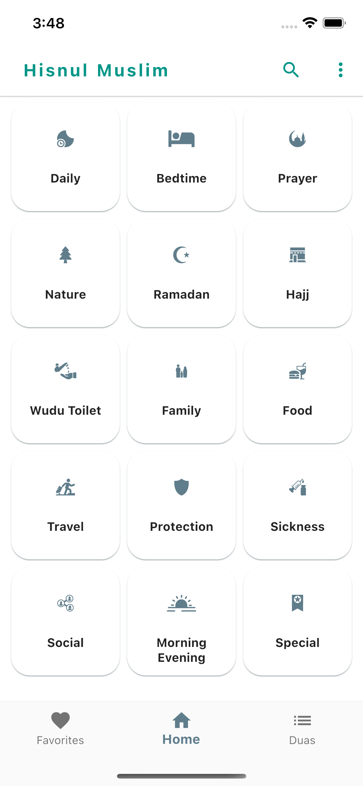
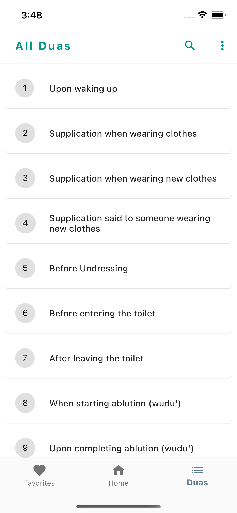
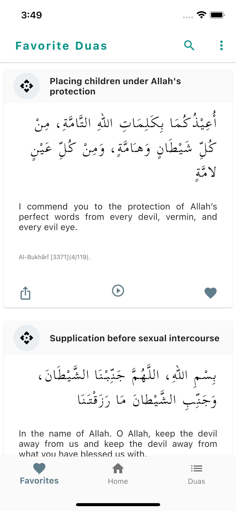

# hisnulmuslim
An app built with Flutter. This is the most authentic app for Hisnul Muslim. No deletion or addition is made to the duas from the book. Simple and easy to use user interface to read, listen and save dua. 

Find all duas from the sunnah of the Prophet (pbuh), read the dua from Fortress of the Muslims (Hisnul Muslim) invocation from the Quran and Sunnah. Islamic prayer and supplications are those that can be used to ask Allah (swt) to grant you good in this world and the here after. Playstore link (10k+ active device): https://play.google.com/store/apps/details?id=com.minbarapps.hisnulmuslim&pcampaignid=web_share

### Homepage demo

### List demo

### Favourite demo

